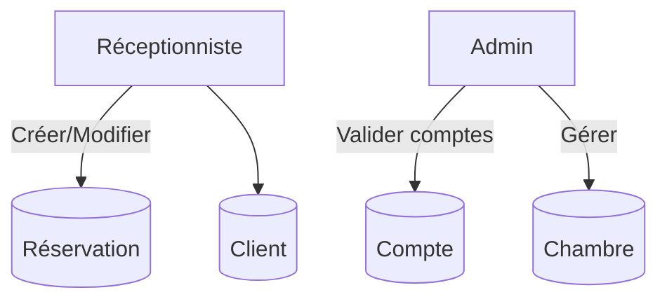

# Conception

La conception fonctionnelle s’appuie sur une analyse des besoins recueillis auprès de gérants d’hôtel.  
Les principaux irritants identifiés dans la gestion traditionnelle sont :

| # | Problématique | Impact |
|---|---------------|--------|
| 1 | Perte de temps due aux registres papier | Baisse de productivité |
| 2 | Mauvaise traçabilité des documents | Risque de perte ou vol de données |
| 3 | Difficulté de recherche d’information | Attente prolongée pour le client |

## Cas d’utilisation

## Modèle MVC choisi

* **Model** : entités Java + scripts PL/SQL pour la logique métier côté base  
* **View** : interfaces **FXML** stylées en **CSS** sombre inspiré d’Appwrite  
* **Controller** : classes JavaFX qui orchestrent les appels JDBC / PL/SQL et la navigation UI
